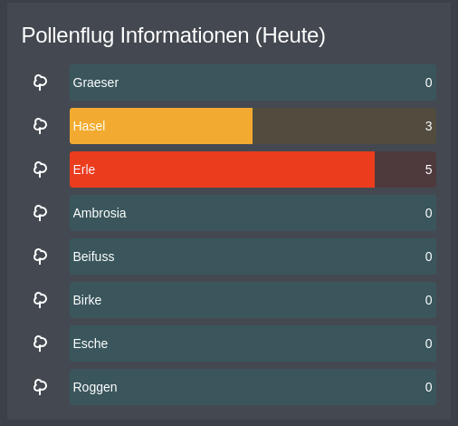

# Pollen information for HA with DWD open data

## Introduction
This guide will help you to integrate pollen information into Home Assistant using DWD open data.
It is especially useful if you have allergies and want to know the pollen count in your area.


## Prerequisites
- [Home Assistant](https://www.home-assistant.io/) instance
- [standalone sensors.yaml](splitConfigIntoDifferentFiles.md)

## Configuration
### Needed Information
| Name           | Description                                                       | Where to find                                                                                                                                                                                         |
|----------------|-------------------------------------------------------------------|-------------------------------------------------------------------------------------------------------------------------------------------------------------------------------------------------------|
| PART_REGION_ID | The ID of the region you want to get the pollen information from. | [DWD Open Data](https://opendata.dwd.de/climate_environment/health/alerts/Beschreibung_pollen_s31fg.pdf) - Search Document for your region and take the **ID**. Don't use the ones with 0 at the end. |

### Sensor
[sensors.yaml](../../media/pollenSensors.yaml)


!!! note "What to change"
    Change the `PART_REGION_ID` to your region ID.

??? info "What it does"
    This will create two types of sensors. 
    
    * The first one is a sensor to parse the json data from the DWD open data and only select the right region.
    * The second one is a template sensor that will create a sensor for each pollen type with the current pollen count for `0-6` for today and attribute for the value of today and tomorrow.

### Restart
After adding the sensor to your configuration, restart Home Assistant. You should now have a sensor for the pollen count in your region.

### Lovelace
Now you just could use any card to display the information but I recommend using the custom bar card.
You can install it though HACS (Frontend) and is called `Bar Card`. 

#### Bar Card
??? abstract "Today"
    ```yaml
    type: custom:bar-card
    entities:
      - entity: sensor.dwd_pollen_erle
        max: '6'
        min: '0'
        decimal: '0'
        severity:
          - from: '0'
            to: '0'
            color: cyan
          - from: '1'
            to: '1'
            color: green
          - from: '2'
            to: '4'
            color: yellow
          - from: '5'
            to: '6'
            color: red
      - entity: sensor.dwd_pollen_ambrosia
        max: '6'
        min: '0'
        decimal: '0'
        severity:
          - from: '0'
            to: '0'
            color: cyan
          - from: '1'
            to: '1'
            color: green
          - from: '2'
            to: '4'
            color: yellow
          - from: '5'
            to: '6'
            color: red
      - entity: sensor.dwd_pollen_beifuss
        max: '6'
        min: '0'
        decimal: '0'
        severity:
          - from: '0'
            to: '0'
            color: cyan
          - from: '1'
            to: '1'
            color: green
          - from: '2'
            to: '4'
            color: yellow
          - from: '5'
            to: '6'
            color: red
      - entity: sensor.dwd_pollen_birke
        max: '6'
        min: '0'
        decimal: '0'
        severity:
          - from: '0'
            to: '0'
            color: cyan
          - from: '1'
            to: '1'
            color: green
          - from: '2'
            to: '4'
            color: yellow
          - from: '5'
            to: '6'
            color: red
      - entity: sensor.dwd_pollen_erle
        max: '6'
        min: '0'
        decimal: '0'
        severity:
          - from: '0'
            to: '0'
            color: cyan
          - from: '1'
            to: '1'
            color: green
          - from: '2'
            to: '4'
            color: yellow
          - from: '5'
            to: '6'
            color: red
      - entity: sensor.dwd_pollen_esche
        max: '6'
        min: '0'
        decimal: '0'
        severity:
          - from: '0'
            to: '0'
            color: cyan
          - from: '1'
            to: '1'
            color: green
          - from: '2'
            to: '4'
            color: yellow
          - from: '5'
            to: '6'
            color: red
      - entity: sensor.dwd_pollen_graeser
        max: '6'
        min: '0'
        decimal: '0'
        severity:
          - from: '0'
            to: '0'
            color: cyan
          - from: '1'
            to: '1'
            color: green
          - from: '2'
            to: '4'
            color: yellow
          - from: '5'
            to: '6'
            color: red
      - entity: sensor.dwd_pollen_hasel
        max: '6'
        min: '0'
        decimal: '0'
        severity:
          - from: '0'
            to: '0'
            color: cyan
          - from: '1'
            to: '1'
            color: green
          - from: '2'
            to: '4'
            color: yellow
          - from: '5'
            to: '6'
            color: red
      - entity: sensor.dwd_pollen_roggen
        max: '6'
        min: '0'
        decimal: '0'
        severity:
          - from: '0'
            to: '0'
            color: cyan
          - from: '1'
            to: '1'
            color: green
          - from: '2'
            to: '4'
            color: yellow
          - from: '5'
            to: '6'
            color: red
    title: Pollenflug Informationen
    ```

??? abstract "Tomorrow"
    ```yaml
    type: custom:bar-card
    entities:
      - entity: sensor.dwd_pollen_erle
        attribute: tomorrow
        max: '6'
        min: '0'
        decimal: '0'
        severity:
          - from: '0'
            to: '0'
            color: cyan
          - from: '1'
            to: '1'
            color: green
          - from: '2'
            to: '4'
            color: yellow
          - from: '5'
            to: '6'
            color: red
      - entity: sensor.dwd_pollen_ambrosia
        attribute: tomorrow
        max: '6'
        min: '0'
        decimal: '0'
        severity:
          - from: '0'
            to: '0'
            color: cyan
          - from: '1'
            to: '1'
            color: green
          - from: '2'
            to: '4'
            color: yellow
          - from: '5'
            to: '6'
            color: red
      - entity: sensor.dwd_pollen_beifuss
        attribute: tomorrow
        max: '6'
        min: '0'
        decimal: '0'
        severity:
          - from: '0'
            to: '0'
            color: cyan
          - from: '1'
            to: '1'
            color: green
          - from: '2'
            to: '4'
            color: yellow
          - from: '5'
            to: '6'
            color: red
      - entity: sensor.dwd_pollen_birke
        attribute: tomorrow
        max: '6'
        min: '0'
        decimal: '0'
        severity:
          - from: '0'
            to: '0'
            color: cyan
          - from: '1'
            to: '1'
            color: green
          - from: '2'
            to: '4'
            color: yellow
          - from: '5'
            to: '6'
            color: red
      - entity: sensor.dwd_pollen_erle
        attribute: tomorrow
        max: '6'
        min: '0'
        decimal: '0'
        severity:
          - from: '0'
            to: '0'
            color: cyan
          - from: '1'
            to: '1'
            color: green
          - from: '2'
            to: '4'
            color: yellow
          - from: '5'
            to: '6'
            color: red
      - entity: sensor.dwd_pollen_esche
        attribute: tomorrow
        max: '6'
        min: '0'
        decimal: '0'
        severity:
          - from: '0'
            to: '0'
            color: cyan
          - from: '1'
            to: '1'
            color: green
          - from: '2'
            to: '4'
            color: yellow
          - from: '5'
            to: '6'
            color: red
      - entity: sensor.dwd_pollen_graeser
        attribute: tomorrow
        max: '6'
        min: '0'
        decimal: '0'
        severity:
          - from: '0'
            to: '0'
            color: cyan
          - from: '1'
            to: '1'
            color: green
          - from: '2'
            to: '4'
            color: yellow
          - from: '5'
            to: '6'
            color: red
      - entity: sensor.dwd_pollen_hasel
        attribute: tomorrow
        max: '6'
        min: '0'
        decimal: '0'
        severity:
          - from: '0'
            to: '0'
            color: cyan
          - from: '1'
            to: '1'
            color: green
          - from: '2'
            to: '4'
            color: yellow
          - from: '5'
            to: '6'
            color: red
      - entity: sensor.dwd_pollen_roggen
        attribute: tomorrow
        max: '6'
        min: '0'
        decimal: '0'
        severity:
          - from: '0'
            to: '0'
            color: cyan
          - from: '1'
            to: '1'
            color: green
          - from: '2'
            to: '4'
            color: yellow
          - from: '5'
            to: '6'
            color: red
    title: Pollenflug Informationen (Morgen)
    ```

Customize the cards to your needs.


## Source
* [Tutorial](https://smarthomeyourself.de/pollenflug-daten-in-home-assistant/)
* [DWD Open Data](https://opendata.dwd.de/climate_environment/health/alerts/)