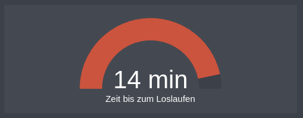
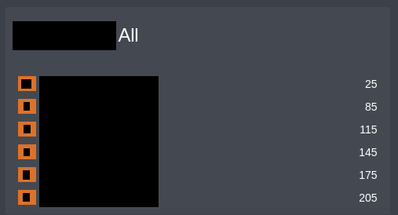

# RMV - When do I need to go?
## Introduction
See the time remaining until you have to leave to catch the next ride. I often have to catch a train or bus and I want to know when I have to leave to catch it.


## Prerequisites
- [Home Assistant](https://www.home-assistant.io/) instance
- (optional) [standalone sensors.yaml](splitConfigIntoDifferentFiles.md)

## Configuration
### Needed Information
| Name         | Description                                                                                                      | Where to find                                                                                                                            |
|--------------|------------------------------------------------------------------------------------------------------------------|------------------------------------------------------------------------------------------------------------------------------------------|
| Station ID   | The ID of the station you want to get the next departure from.                                                   | [RMV (Infrastrukturdaten)](https://opendata.rmv.de/site/start.html) - Search Document for your station and take the **ID**               |
| Time Offset  | The time offset in minutes you need to get to the station.                                                       | GoogleMaps/RMVGo or just from experience                                                                                                 |
| Direction    | The direction you want to go.                                                                                    | [RMV (Infrastrukturdaten)](https://opendata.rmv.de/site/start.html) - Search Document for your destination station and take the **NAME** | 
| Station Name | The name of the station you want to get the next departure from. Choose what you want. Recommend name of station |                                                                                                                                          |

### Sensor
```yaml
# sensors.yaml
- platform: rmvtransport
  next_departure:
    - station: [Station ID]
      time_offset: [Time Offset]
      direction: [Direction]
    - station: [Station ID]
      name: [Station Name] All
      direction: [Direction]

```

### Restart
After adding the sensor to your configuration, restart Home Assistant. You should now have a sensor for all the departures from the station and a sensor for the next departures from the station **you can reach**.

### Helper
To get the sensor for the time you need to leave, you have to create a template sensor. This sensor will calculate the time you have to leave to catch the next ride.
Go to Settings -> Devices & Services -> Helpers -> Add Helper -> Template -> Create template for a sensor

Give it a name and use the following template:

_**&#123;&#123; (int(states('sensor.[Station Name without all]'))) - 7 }}**_

Set the unit to minutes and save it.

### Lovelace
I use the following Lovelace card to display the time I have to leave to catch the next ride.
```yaml
type: gauge
entity: sensor.[Helper Sensor Name]
needle: false
min: 0
max: 15
severity:
  green: 3
  yellow: 7
  red: 10
```
Tweak the values to your needs.

#### Time Table Card


There is also a custom card in HACS to display the next departures from a station. It is called `RMV Card` and can be found in HACS (Frontend).
After installing it you can use the following code to display the next departures from a station:
```yaml
type: custom:rmv-card
entity:
  - sensor.[Station Name with all]
```


## Source
* [Home Assistant RMV Integration](https://www.home-assistant.io/integrations/rmvtransport/)
* [RMV API](https://opendata.rmv.de/site/start.html)
* [RMV Card](https://community.home-assistant.io/t/rmv-transport-departures/63935)