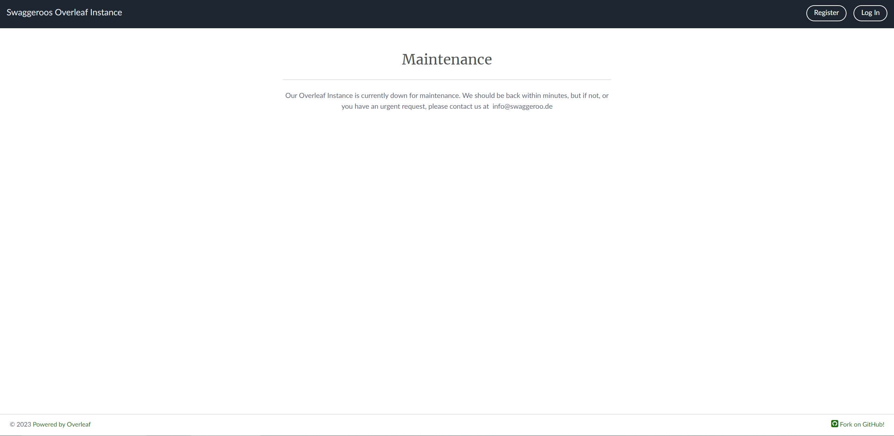

# Creating own Overleaf Instance
[Overleaf Project](https://github.com/overleaf/overleaf)

I will use the Overleaf Toolkit to create a local instance of Overleaf.


??? info "Docker Environment"
    In preparation for the Overleaf instance, you must have Docker and Docker Compose running on your server.

## Download
```bash
git clone https://github.com/overleaf/toolkit.git ./overleaf-toolkit
```
```bash
cd overleaf-toolkit
```

## Configuration
### Init
```bash
bin/init
```

### Docker Configuration
```bash
nano config/overleaf.rc
```
I changed `SHARELATEX_LISTEN_IP` to `0.0.0.0` to make the instance accessible from the outside.
I also changed the port because I already have a service running on port 80.
Save the file and exit the editor.


### Environment Variables
```bash
nano config/variables.env
```

I changed the following variables:
```bash
SHARELATEX_SITE_URL=[your domain / IP]
SHARELATEX_NAV_TITLE=[Title for your Overleaf instance]
SHARELATEX_ADMIN_EMAIL=[your email]
```

#### SMTP Server (OPTIONAL)
I also changed the following variables to use my own SMTP server:
```bash
SHARELATEX_EMAIL_FROM_ADDRESS=[your email]
SHARELATEX_EMAIL_SMTP_HOST=[your SMTP server]
SHARELATEX_EMAIL_SMTP_PORT=[your SMTP port]
SHARELATEX_EMAIL_SMTP_SECURE=[true or false]
SHARELATEX_EMAIL_SMTP_USER=[your SMTP user]
SHARELATEX_EMAIL_SMTP_PASS=[your SMTP password]
SHARELATEX_EMAIL_SMTP_IGNORE_TLS=[true or false]
```
I had to use the alternative port 587 from my SMTP server provider.

See [Configuring SMTP Email](https://github.com/overleaf/overleaf/wiki/Configuring-SMTP-Email)


## Start
### First Start
For the first start use:
```bash
bin/up
```

Now Docker Composer will download all necessary images and start the Overleaf instance.
Wait some time than try opening your Overleaf instance in your browser with the following URL:
```bash
http://[your domain / IP]:[your port]/launchpad
```

There you can create your first user and login.

On the page after the login are the status of the Overleaf instance. This should show *`OK`* for all services.

There you also can send a test email if you [set up your SMTP server](#smtp-server-optional).

Now you can stop the Overleaf instance with `CTRL+C`.

### Start
For starting the Overleaf instance use:
```bash
bin/start
```

To stop it again use:
```bash
bin/stop
```

## Getting Full Functionality
Overleaf is shipped with only the basic functionality. To get the full functionality you have to download the remaining packages.

Enter container shell:
```bash
bin/shell
```

Download full package set (1) :
{ .annotate }

1.      For this the container must be running. Also this takes some time.

```bash
tlmgr install scheme-full
```

Exit container shell:
```bash
exit
```

**Congratulations!** You now have your own Overleaf instance running.

### EVEN MORE PACKAGES
Enter container shell (if not already done):
```bash
bin/shell
```

If you want even more packages, you can use the following command:
```bash
wget https://mirror.clientvps.com/CTAN/systems/texlive/tlnet/install-tl-unx.tar.gz
```

```bash
tar -xf install-tl-unx.tar.gz
cd install-tl-*
perl install-tl
```
Then choose ``I`` to install all packages.


## Fix "Our Overleaf Instance is currently down for maintenance."

If your Overleaf instance is showing the following message:


Enter container shell:
```bash
bin/shell
```

edit the following file: `/etc/sharelatex/site_status` and replace `closed` with `open`.


## Source
[Overleaf-Toolkit](https://github.com/overleaf/toolkit/)
[Fix Maintenance Mode](https://github.com/overleaf/toolkit/issues/186)
[Install more packages](https://blog.felixviola.de/overleaf-ce-self-host-your-own-latex-server-tutorial/)